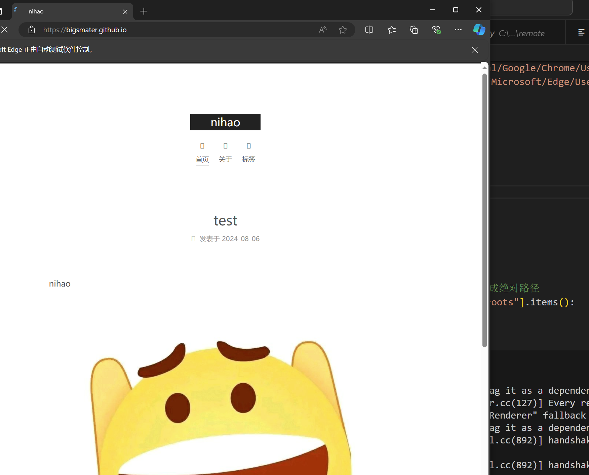

将浏览器收藏夹的网站们以mhtml格式储存到本地，包括收藏夹的文件夹相对位置啥的

```
pip install selenium
python test.py
```


默认是以相对路径储存的，所以得在想保存的那个位置运行脚本，绝对路径的话可以自己改

默认是Edge浏览器的收藏夹，谷歌浏览器或者其他的改个参数或者自己找绝对路径，默认Path=EDGE_PATH

运行时会弹出个浏览器，让它自己自己跳即可


